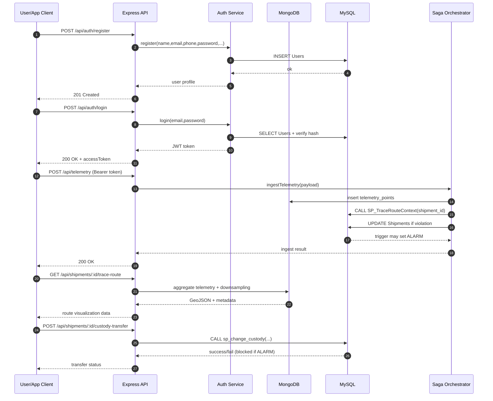

# System Flow End-to-End

## 1. Muc tieu tai lieu
Tai lieu nay mo ta chi tiet luong he thong Global Supply Chain & Asset Telemetry tu dau den cuoi, bao gom:
- Dang ky/dang nhap nguoi dung.
- Nhan telemetry tu thiet bi IoT va danh gia vi pham nhiet do.
- Kich hoat trang thai ALARM va khoa nghiep vu ban giao.
- Truy vet hanh trinh shipment (GeoJSON).
- Toi uu tuyen duong dua tren du lieu lich su.

Tai lieu duoc viet theo codebase hien tai de team co the dung ngay khi implement API tiep theo.

## 2. Kien truc tong quan
He thong su dung mo hinh hybrid database:
- MySQL: du lieu nghiep vu co cau truc va rang buoc phap ly (Shipments, Ownership, AlarmEvents, Users, Parties, Ports, CargoProfiles).
- MongoDB: du lieu telemetry theo thoi gian (telemetry_points), du lieu phan tich route (shipment_routes, port_edges, telemetry_logs).

Application layer: Node.js + Express.
- Entry point: `src/app.js`
- Route da mount:
  - `POST /api/telemetry`
  - `POST /api/auth/register`
  - `POST /api/auth/login`
  - `GET /api/auth/me`

## 3. Thanh phan chinh
- API Layer:
  - `src/routes/auth.route.js`
  - `src/routes/telemetry.route.js`
- Business services:
  - `src/services/auth.service.js`
  - `src/services/saga-orchestrator.js`
  - `src/services/route_optimization.service.js`
- SQL schema va SP:
  - `src/configs/mysql.sql`
  - `src/database/sql/sp_change_custody.sql`
- Mongo aggregation:
  - `src/database/mongo/trace_route_aggregation.js`
  - `src/database/mongo/route_optimization_aggregation.js`

## 4. Pre-conditions (truoc khi chay flow)
1. Co file env hop le (`.env` trong root hoac `src/.env`).
2. Ket noi duoc MySQL va MongoDB.
3. Da tao schema MySQL (Users, Shipments, Ownership, ...).
4. Da tao collection/index MongoDB cho telemetry.
5. Co du lieu master toi thieu: Parties, Ports, CargoProfiles, Shipments.

## 5. Flow A - Khoi dong he thong
1. App nap env trong `src/app.js`.
2. App ket noi MongoDB (`connectMongoDB`).
3. App ket noi MySQL (`connectMySQL`).
4. App bind route va listen cong `PORT`.

Ket qua:
- He thong san sang nhan auth request va telemetry request.

## 6. Flow B - Dang ky tai khoan
Endpoint: `POST /api/auth/register`

Request body:
```json
{
  "name": "Nguyen Van A",
  "email": "a@example.com",
  "phone": "0901234567",
  "password": "12345678",
  "role": "OWNER",
  "partyId": null
}
```

Xu ly:
1. Validate bat buoc: `name`, `email`, `phone`, `password`.
2. Chuan hoa email ve lower-case.
3. Kiem tra email da ton tai trong `Users`.
4. Hash password bang bcrypt.
5. Tao `UserID` (UUID).
6. Insert vao `Users` voi `Status='ACTIVE'`.

Response thanh cong:
- Tra ve user thong tin co `userId`, `name`, `email`, `phone`, `role`, `partyId`.

## 7. Flow C - Dang nhap va xac thuc
Endpoint: `POST /api/auth/login`

Xu ly:
1. Validate `email`, `password`.
2. Tim user theo email.
3. Kiem tra `Status='ACTIVE'`.
4. Compare password hash.
5. Tao JWT (`JWT_SECRET`, `JWT_EXPIRES_IN`).
6. Tra ve `accessToken` + user profile.

Flow truy cap endpoint bao ve:
1. Client gui header `Authorization: Bearer <token>`.
2. Middleware `authenticate` verify JWT.
3. Neu hop le, gan `req.user` cho handler tiep theo.
4. Co the dung `authorizeRoles(...)` de phan quyen theo role.

## 8. Flow D - Ingest telemetry (Saga Orchestrator)
Endpoint: `POST /api/telemetry`

Request body mau:
```json
{
  "shipment_id": "SHP-001",
  "device_id": "DEV-001",
  "timestamp": "2026-03-18T10:00:00Z",
  "location": { "lng": 106.7, "lat": 10.7 },
  "temp": 8.5,
  "humidity": 55
}
```

Xu ly trong `ingestTelemetry`:
1. Validate field bat buoc.
2. Ghi diem telemetry vao Mongo `telemetry_points`.
3. Goi SP MySQL `SP_TraceRouteContext(shipment_id)` de lay `TempMax` cua shipment.
4. So sanh `temp > TempMax`.
5. Neu vi pham:
- Update `Shipments.LastTelemetryStatus='VIOLATION'`.
- Update `Shipments.LastTelemetryAtUTC`.
- Ghi `AlarmReason` neu chua co.
6. Trigger SQL (neu da khai bao) se dua shipment sang `Status='ALARM'`.

Ket qua:
- He thong dong bo du lieu telemetry theo luong hybrid (Mongo + MySQL).

## 9. Flow E - Alarm lifecycle va khoa nghiep vu
Khi shipment bi vi pham:
1. Shipments co `LastTelemetryStatus='VIOLATION'`.
2. Trigger/logic SQL co the set `Status='ALARM'` va tao event alarm.
3. Trong trang thai ALARM, nghiep vu custody transfer bi chan.

He qua nghiep vu:
- Dam bao chain of custody khong bi chuyen giao khi lo hang dang co rui ro.

## 10. Flow F - Custody transfer (stored procedure)
Muc tieu endpoint (de implement): `POST /api/shipments/:shipmentId/custody-transfer`

Backend goi `sp_change_custody` voi input:
- `p_shipment_id`, `p_from_party_id`, `p_to_party_id`, `p_handover_port_code`, ...

Xu ly trong SP:
1. Validate input.
2. Kiem tra shipment ton tai.
3. Kiem tra shipment KHONG o trang thai `ALARM`.
4. Kiem tra ben chuyen giao la owner hien tai.
5. Dong ownership cu (`EndAtUTC`).
6. Tao ownership moi cho ben nhan.
7. Cap nhat `Shipments.CurrentPortCode`.
8. Commit/Rollback nguyen tu.

## 11. Flow G - Trace route cho dashboard
Muc tieu endpoint (de implement):
- `GET /api/shipments/:shipmentId/trace-route?tempThreshold=8&maxPoints=1000`

Xu ly:
1. Doc telemetry theo shipment trong Mongo.
2. Sort theo thoi gian.
3. Downsampling neu qua nhieu diem.
4. Danh dau diem vi pham theo `tempThreshold`.
5. Tra ve GeoJSON FeatureCollection + metadata:
- tong diem,
- ti le vi pham,
- thong ke nhiet do,
- thong tin hieu nang query.

## 12. Flow H - Route optimization
Muc tieu endpoint (de implement):
- `GET /api/routes/optimize?origin=VNSGN&destination=USNYC`

Xu ly trong service:
1. Validate origin/destination.
2. Kiem tra ton tai port trong du lieu edge.
3. Chay aggregation graph de tim cac route hop le.
4. Cham diem theo thoi gian, so stop, alarm rate.
5. Tra ve route de xuat + insight.

## 13. Luong sequence tong hop


## 14. Danh sach API hien tai va de xuat
Da co:
- `POST /api/auth/register`
- `POST /api/auth/login`
- `GET /api/auth/me`
- `POST /api/telemetry`

Nen lam tiep theo thu tu:
1. `GET /api/shipments/:shipmentId/trace-route`
2. `POST /api/shipments/:shipmentId/custody-transfer`
3. `GET /api/shipments/:shipmentId/status`
4. `GET /api/routes/optimize`
5. `GET /api/alerts`

## 15. Error handling va observability
Nhom loi chinh:
- 400: input khong hop le.
- 401: token sai/het han.
- 403: role khong du quyen.
- 404: shipment/context khong ton tai.
- 500: loi he thong.

Khuyen nghi:
1. Them request-id cho moi request de trace log.
2. Log cau truc JSON cho service quan trong (auth, ingest, custody).
3. Them metrics co ban: request count, latency, violation rate.
4. Them health endpoints: `/health/live`, `/health/ready`.

## 16. Pham vi va ghi chu
- Tai lieu nay phan biet ro giua "da co" va "de implement".
- Neu schema/trigger/SP thay doi, can cap nhat lai tai lieu nay de dong bo voi code.
